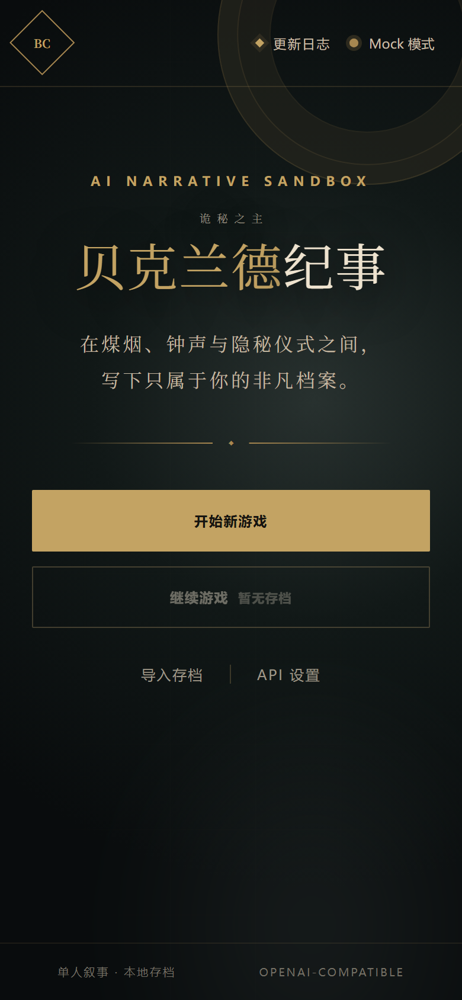
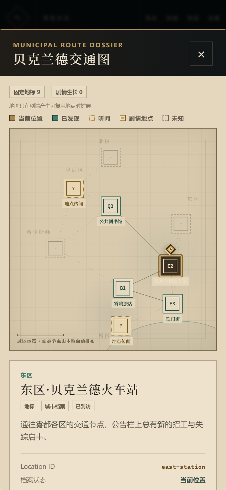

# 贝克兰德纪事


在煤烟与神秘交织的鲁恩王国首都贝克兰德，写下属于你自己的诡秘篇章。这是一款由大语言模型驱动的**单人 AI 文字冒险沙盒**：没有预设剧本，没有固定结局，你的每一次抉择都由 AI 叙事者即时推演成独一无二的故事。

## 玩法

- **原创角色开局**：创建属于你自己的角色踏入贝克兰德——原作主线与重要人物只是遥远背景，这座城市的街巷、人物、案件与秘密围绕你展开。
- **自由行动**：用自然语言描述你想做的任何事——调查一桩离奇命案、经营一间不起眼的店铺、或是触碰不该触碰的神秘力量，AI 会推演后果并推动世界运转。
- **状态驱动的真实世界**：金钱、物品、地点、人际关系都被世界模拟器持续追踪；买了一张车票就真的会少一便士，结仇的黑帮真的会记住你。
- **动态地图**：探索过的街区与传闻中的地点会出现在地图上，城市随你的足迹逐渐清晰。
- **长期记忆**：剧情摘要让 AI 记住几十轮前埋下的伏笔，故事越玩越厚。

## 游玩方式

- **双模式节奏**：标准模式层层推演、细节丰满；快速模式并发工作流 + 上下文缓存，几秒内给出回应。
- **网页版即开即玩**：打开在线版，填入任意一家服务商的 API Key（支持 OpenAI、DeepSeek、Gemini、OpenRouter，也支持本地 Ollama 离线运行）即可开局。
- **安卓 APK 随身冒险**：Releases 页下载安装，应用内自动检查更新，存档导出/导入随时备份你的传奇。
- **你的数据你做主**：API Key 仅存本地，存档完全掌握在自己手里。

## 游戏画面

| 标题页 | 剧情与行动 | 城市地图 |
| --- | --- | --- |
|  |  |  |

## 在线游玩与下载

- 在线版：<https://bemyself001.github.io/backlund-chronicle/>
- Android APK：<https://github.com/Bemyself001/backlund-chronicle/releases/latest>

在线版由 GitHub Pages 自动发布，不依赖 Cloudflare。每次推送到 `main` 分支都会重新部署网页，并生成一个带递增版本号的正式签名 APK Release。

## 运行

需要 Node.js 20.19+ 或 22.12+。

```bash
npm ci
npm run dev
```

质量检查：

```bash
npm run lint
npm run build
npm run preview
```

## 目录

- `src/components/`：欢迎页、角色创建、游戏三栏、移动抽屉及设置面板。
- `src/data/`：默认角色、初始世界与系统提示词。
- `src/engine/`：AI 工具调用的参数、权限、去重与执行验证。
- `src/services/`：OpenAI-compatible API、JSON 协议、记忆与存档。
- `src/styles/`：全局 token、重置与通用交互状态。

## 数据与密钥

游戏存档保存在 LocalStorage。API Key 默认只保存在 sessionStorage；只有用户明确开启“跨会话保存”时才会写入单独的本地 API 设置。剧情状态与导出的 JSON 存档均会剔除 API Key。

API Key 输入框使用本地圆点遮罩而非系统密码字段，并请求浏览器关闭自动填充；Android APK 还会将 Activity 根视图和游戏 WebView 排除出系统自动填充，以避免部分 ColorOS 设备反复弹出密码建议。手动输入、粘贴和用户主动选择的本地密钥保存不受影响。

没有 API Key 时保持 Mock 模式即可完成全部核心流程。真实接口默认按 OpenAI Chat Completions 协议调用，兼容流式输出、原生 tool calling 与 JSON 回退。

## GitHub 云端构建 APK

项目包含 Capacitor Android 工程与 `.github/workflows/build-android-apk.yml`。代码推送到 GitHub 的 `main` 分支后会自动构建正式签名 APK，也可以在仓库的 **Actions → Build Android APK → Run workflow** 手动运行。产品版本由 `src/data/release.js` 维护；为兼容已经发布的 `v1.3.102` 等安装包，流水线继续以 `1.3.<完整提交数>` 生成 Android 与 OTA 兼容构建号，并以 `30000 + 完整提交数` 生成始终递增的 `versionCode`。例如产品版本 1.3.5 可对应兼容构建 `v1.3.105`。

正式构建依赖四个 GitHub Actions Secrets：`ANDROID_KEYSTORE_BASE64`、`ANDROID_KEYSTORE_PASSWORD`、`ANDROID_KEY_ALIAS` 和 `ANDROID_KEY_PASSWORD`。签名文件及其本地恢复信息保存在被 Git 忽略的 `.signing/`；必须离线备份，丢失后将无法覆盖更新现有安装。

构建完成后，可直接从仓库的 **Releases** 页面下载 `backlund-chronicle.apk`，无需登录且不会像 Actions Artifact 一样在 14 天后过期。APK 会在启动约两秒后每天至多自动检查一次最新版；也可在 **API 设置 → 检查应用更新** 手动检查。支持热更新的正式版会下载包含页面资源与标题字体的更新包（约 3.3 MB）并在下次启动时生效；完整 APK 下载与安装仍由 Android 系统要求用户确认。

旧的 `apk-8`、`apk-9` 等版本使用临时调试签名，无法直接覆盖升级为新的正式签名版。首次迁移前请先导出游戏存档，然后卸载旧版、安装新正式版并导入存档；API Key 不包含在存档中，需要重新填写。

本地同步 Android 网页资源：

```bash
pnpm install
pnpm run android:sync
```

## 开源许可与版权说明

本仓库中由项目作者原创的程序代码与原创素材采用 [MIT License](LICENSE) 发布，Copyright © 2026 Bemyself001。

MIT License 不授予《诡秘之主》名称、世界观、角色、地点、设定或其他第三方知识产权的任何权利。本项目为非官方同人创作，与原作者、出版方及其他权利人无隶属、授权或背书关系。使用者在复制、修改或分发项目时，仍须自行确保其内容使用符合适用法律及第三方权利要求。
