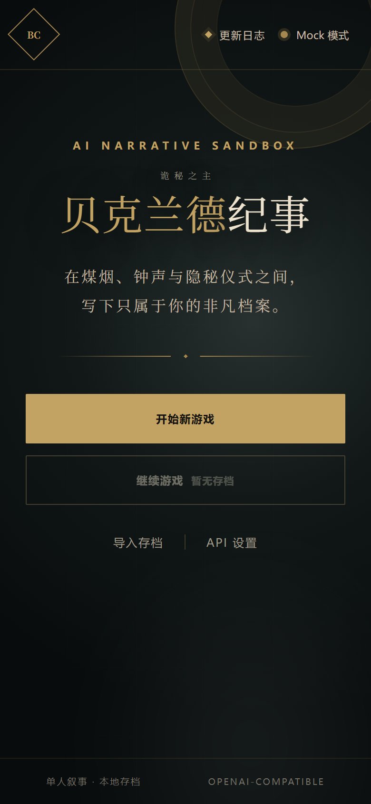
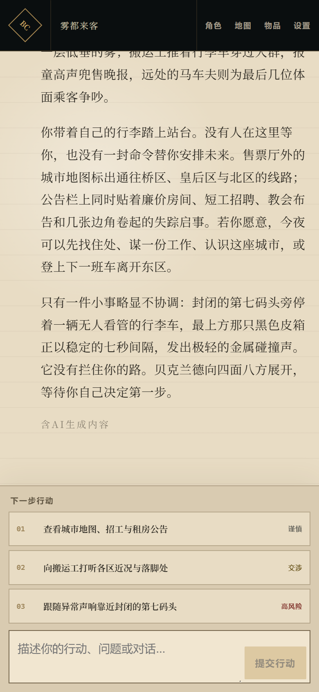
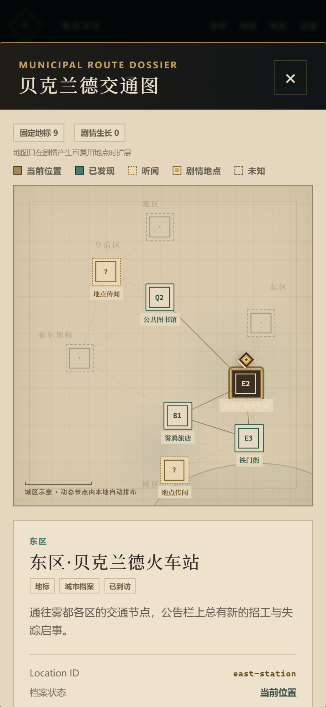

# 贝克兰德纪事


在煤烟与神秘交织的鲁恩王国首都贝克兰德，写下属于你自己的诡秘篇章。这是一款由大语言模型驱动的**单人 AI 文字冒险沙盒**：没有预设剧本，没有固定结局，你的每一次抉择都由 AI 叙事者即时推演成独一无二的故事。

## 玩法

- **原创角色开局**：创建属于你自己的角色踏入贝克兰德，在原创支线中展开调查；也可前往明斯克街15号拜访私家侦探夏洛克·莫里亚蒂。
- **自由行动**：用自然语言描述你想做的任何事——调查一桩离奇命案、经营一间不起眼的店铺、或是触碰不该触碰的神秘力量，AI 会推演后果并推动世界运转。
- **状态驱动的真实世界**：金钱、物品、地点、人际关系都被世界模拟器持续追踪；买了一张车票就真的会少一便士，结仇的黑帮真的会记住你。
- **动态地图**：探索过的街区与传闻中的地点会出现在地图上，城市随你的足迹逐渐清晰。
- **长期记忆**：剧情摘要让 AI 记住几十轮前埋下的伏笔，故事越玩越厚。

## 游玩方式

- **双模式节奏**：标准模式层层推演、细节丰满；快速模式并发工作流 + 上下文缓存，几秒内给出回应。
- **网页版即开即玩**：打开在线版，填入任意一家服务商的 API Key（支持 OpenAI、DeepSeek、Gemini、OpenRouter，也支持本地 Ollama 离线运行）即可开局。
- **安卓 APK 随身冒险**：Releases 页下载安装，应用内自动检查更新，存档导出/导入随时备份你的传奇。
- **你的数据你做主**：API Key 仅存本地，存档完全掌握在自己手里。

## 游戏画面

| 标题页 | 剧情与行动 | 城市地图 |
| --- | --- | --- |
|  |  |  |

## 在线游玩与下载

- 在线版：<https://bemyself001.github.io/backlund-chronicle/>
- Android APK：<https://github.com/Bemyself001/backlund-chronicle/releases/latest>

在线版由 GitHub Pages 自动发布，不依赖 Cloudflare。每次推送到 `main` 分支都会重新部署网页，并生成一个带递增版本号的正式签名 APK Release。

## 运行

需要 Node.js 22.13+，项目与发布流水线使用 pnpm。

```bash
pnpm install --frozen-lockfile
pnpm run dev
```

质量检查：

```bash
pnpm test
pnpm run lint
pnpm run build
pnpm exec vite preview --outDir dist/client
```

## 目录

- `src/components/`：欢迎页、角色创建、游戏三栏、移动抽屉及设置面板。
- `src/data/`：默认角色、初始世界与系统提示词。
- `src/engine/`：AI 工具调用的参数、权限、去重与执行验证。
- `src/services/`：OpenAI-compatible API、JSON 协议、记忆与存档。
- `src/styles/`：全局 token、重置与通用交互状态。

## 数据与密钥

游戏存档保存在 LocalStorage。API Key 默认只保存在 sessionStorage；只有用户明确开启“跨会话保存”时才会写入单独的本地 API 设置。剧情状态与导出的 JSON 存档均会剔除 API Key。

点击「存档柜 → 导出当前」后会显示文件名与保存位置。Android 10 及以上的正式 APK 将存档保存到「文件管理 → 内部存储 → Download（下载）→ 贝克兰德纪事」，Android 7–9 使用系统保存窗口选择位置。网页版优先使用浏览器的另存为窗口，不支持时发起浏览器下载并显示查找说明；网页无法获取浏览器最终保存的完整磁盘路径。Android 文件保存功能需要安装 1.6.12 或更新的 APK，仅热更新页面不能新增原生功能。

API Key 输入框使用本地圆点遮罩而非系统密码字段，并请求浏览器关闭自动填充；Android APK 还会将 Activity 根视图和游戏 WebView 排除出系统自动填充，以避免部分 ColorOS 设备反复弹出密码建议。手动输入、粘贴和用户主动选择的本地密钥保存不受影响。

游戏需配置可用的 AI 接口与模型；使用本地 Ollama 等无需密钥的服务时可留空 API Key。接口默认按 OpenAI Chat Completions 协议调用，兼容流式输出、原生 tool calling 与 JSON 回退。

## GitHub 云端构建 APK

项目包含 Capacitor Android 工程与 `.github/workflows/build-android-apk.yml`。代码推送到 GitHub 的 `main` 分支后会自动构建正式签名 APK，也可以在仓库的 **Actions → Build Android APK → Run workflow** 手动运行。产品版本由 `src/data/release.js` 维护，并与工作流 `PRODUCT_VERSION`、`package.json` 和 Android 本地回退版本保持一致。发布标签使用 `v<产品版本>`，Android 内部 `versionCode` 采用 `30000 + 完整提交数`，发布前核验签名证书、包名和版本。

正式构建依赖四个 GitHub Actions Secrets：`ANDROID_KEYSTORE_BASE64`、`ANDROID_KEYSTORE_PASSWORD`、`ANDROID_KEY_ALIAS` 和 `ANDROID_KEY_PASSWORD`。签名文件及其本地恢复信息保存在被 Git 忽略的 `.signing/`；必须离线备份，丢失后将无法覆盖更新现有安装。

构建完成后，可直接从仓库的 **Releases** 页面下载 `backlund-chronicle.apk`，无需登录且不会像 Actions Artifact 一样在 14 天后过期。APK 启动后会检查更新，也可在首页点击「检查更新」。支持热更新的正式版会下载包含页面资源与标题字体的更新包，并在下次启动时生效；完整 APK 下载与安装仍由 Android 系统要求用户确认。

1.6.18 新增首次 API 配置与首页按钮教程，完成或跳过后在本机记住，已有存档自动略过。正式版以 Chromium 80 为语法目标，并补充旧布局和焦点样式回退；浏览器模拟验证覆盖缺失 API、旧 CSS、可见焦点、Tab 顺序和弹窗焦点恢复，仍需具体旧内核与厂商设备的实机验证。首页「启动诊断」可复制启动信息；完整的 Android 原生诊断需要安装 1.6.18 或更新 APK。

1.6.19 补全22途径序列9至5的能力成长与生命、理智、灵性上限成长，修复成品魔药服用并加入夏洛克每瓶1镑的鉴定服务。特殊行动和任务簿分栏，任务可继续追踪、完成归档，接受后的目标和报酬保持稳定。AI 请求采用固定前缀、分段历史和本地关联检索，在调查手记的技术详情中展示真实请求、重试和缓存用量；完整存档保留，统计不包含密钥或请求正文。缓存命中率取决于服务商实际返回，缺少明细时显示未知。

1.7.0 将开局基础资金上限提高至5镑。普攻按目标最大生命值12%结算，序列7和序列5的伤害技能分别为30%和50%；治疗技能分别恢复自身最大生命值20%和30%。狼人每层强化令伤害乘1.2，最多3层，每层消耗1点灵性且仅当前回合有效；单次伤害比例封顶60%。AI选择行动，由本地引擎核验目标、资源和数值，界面同步显示伤害、治疗与消耗预览；旧存档保留资金、伤势及敌人剩余生命并迁移到新规则。

1.7.1 在「特殊行动 → 等待」加入24小时圆环。拖动选择1至24小时，预览结束日期与时间，确认后立即结算并保存，无需等待AI；也可用快捷按钮、加减和键盘操作。每次等待推进1回合，持续状态与任务照常结算，等待本身不提供睡眠恢复；战斗中及生命或理智归零时不可使用。

1.7.5 修复行动选项中的明确移动和跳过时间，先按真实路线及游戏时钟结算，再生成到达后的剧情。可在「特殊行动 → 人物 → 夏洛克」提出调查委托，确认报价后支付费用，在「任务簿 → 我发布的委托」查看进度、询问、领取报告及取消。调查按游戏时间推进，交回报告必定登记1至2条线索；寻找舅舅的报告提供2条继续调查的方向。旧档已经接单并付费、却没有登记的委托，可在夏洛克面板明确确认后补录原费用和剩余时间，不会再次扣费或消耗回合。

旧的 `apk-8`、`apk-9` 等版本使用临时调试签名，无法直接覆盖升级为新的正式签名版。首次迁移前请先导出游戏存档，然后卸载旧版、安装新正式版并导入存档；API Key 不包含在存档中，需要重新填写。

本地同步 Android 网页资源：

```bash
pnpm install
pnpm run android:sync
```

## 开源许可与版权说明

本仓库中由项目作者原创的程序代码与原创素材采用 [MIT License](LICENSE) 发布，Copyright © 2026 Bemyself001。

MIT License 不授予《诡秘之主》名称、世界观、角色、地点、设定或其他第三方知识产权的任何权利。本项目为非官方同人创作，与原作者、出版方及其他权利人无隶属、授权或背书关系。使用者在复制、修改或分发项目时，仍须自行确保其内容使用符合适用法律及第三方权利要求。
